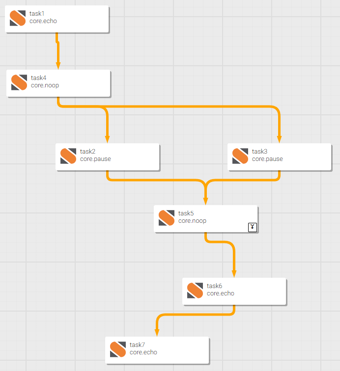
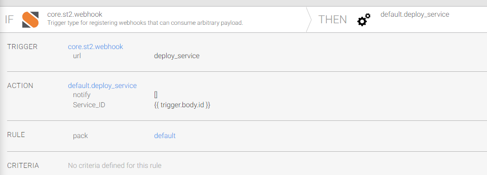
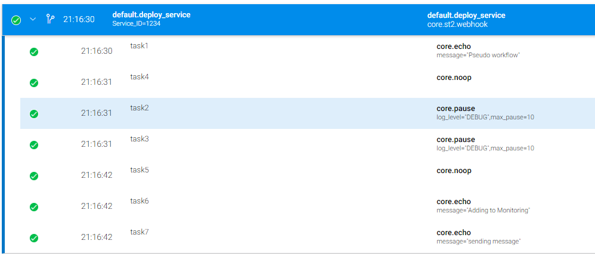

---
tags:
  - st2
  - beginner
  - codespaces
---

# Triggering an ST2 Workflow


|             |                                                                                             |
| ----------: | :-------------------------------------------------------------------------------------------|
| Level       | beginner                                                                                    |
| Repo        | [https://github.com/NetAutLabs/st2_webhook](https://github.com/NetAutLabs/st2_webhook)      |
| Discussion  | [Discussion GitHub Repo](https://github.com/NetAutLabs/st2_webhook/discussions)             |
| Codespaces  | :material-check: [GitHub Codespaces](https://codespaces.new/NetAutLabs/st2_webhook)         |

<div align=center>
<a href="https://codespaces.new/NetAutLabs/NetAutLabs/st2_webhook?quickstart=1">

</a>
</div>

In this lab, you'll explore StackStorm and create a workflow that can be triggered by a webhook.


## Setup

You need to start the containers to interact with the StackStorm (st2). The docker-compose setup (from the st2-docker repo) is only for lab purposes.
From the main directory, you can use the shortcut command `make setup` to initiate it. To tear down the lab, use `make destroy`. 

When starting stackstorm, VSCode will discover the process of listening to port 80 and pop up in the lower right corner to open the URL. This will open the ST2 web UI. StackStorm Username/Password by default is: `st2admin/Ch@ngeMe`

## Tasks

The tasks are divided into multiple subsections. Information can be found in the official [documentation](https://docs.stackstorm.com/).

### Workflow

Create a workflow. We use `core.echo`, `core.pause`, `core.noop` to simulate a workflow that takes a "Service ID" as input and deploys the service in parallel on two systems. After both jobs are finished (join all), the monitoring system is updated, and a notification is sent.




### Rule

Create a rule which uses the `core.st2_webhook` (URL: "deploy_service") as a trigger for the workflow created before. Make sure the service ID is passed to the workflow.




### Trigger Webhook

A token or API key is needed to trigger a webhook. The st2 shell command can be used to generate an API key:

```bash
$ make st2client
root@2687a0f54536:/opt/stackstorm# st2 apikey create -k -m '{"demo": "demo key to invoke webhook"}'
ZmI0NzZkOTYwOTZlMjMyZmMzMzNiMjM1ZTRkOThkZWM0NzlhZmY5MmNmNWY3ZWFmZjZhODQ2ODRhMGZkZTMxNQ
root@2687a0f54536:/opt/stackstorm#
```

Now the webhook can be triggered, and the workflow will be executed.

```bash
$ curl -X POST http://localhost/api/v1/webhooks/deploy_service -H "St2-Api-Key: ZmI0NzZkOTYwOTZlMjMyZmMzMzNiMjM1ZTRkOThkZWM0NzlhZmY5MmNmNWY3ZWFmZjZhODQ2ODRhMGZkZTMxNQ" -H "Content-Type: application/json" --data '{"id": 1234}'
```

### Workflow Execution

If everything goes well, in the "history" tab, the workflow execution should look like the following:



## Next Steps

This exercise was a simple hello world. Feel free to discover the available packs and interact with real systems. StackStorm is a mighty orchestration workflow engine.
